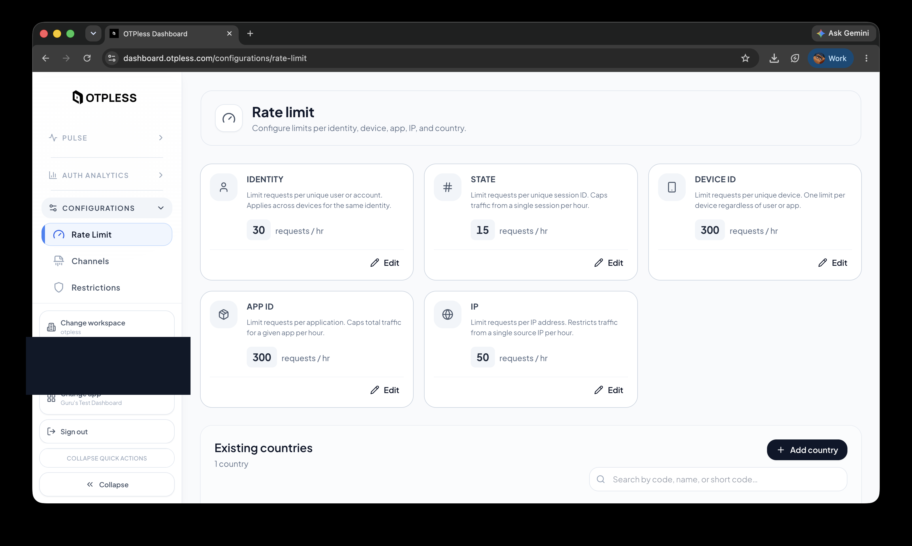
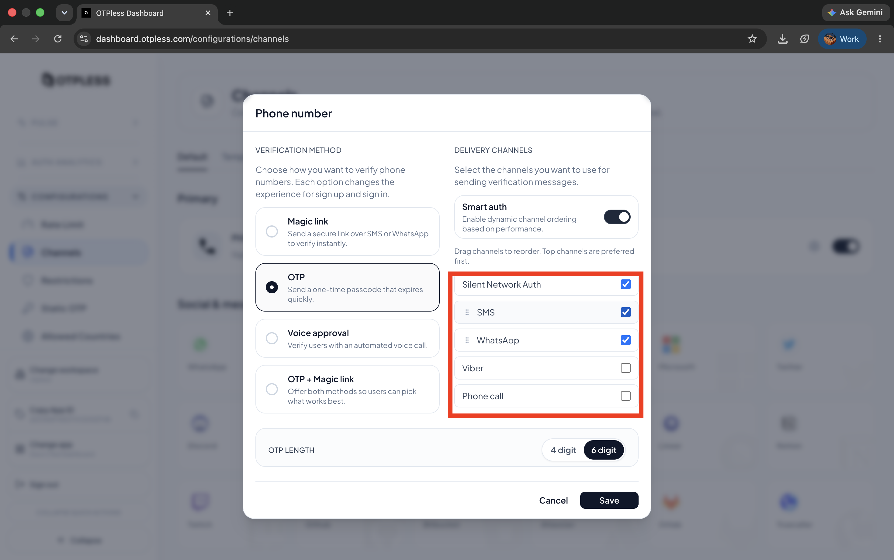

# OTPless Headless Auth Demo (Android · Kotlin · Jetpack Compose)

A single-screen reference/test app showing a complete integration of the
**OTPless Android Headless SDK**
(`io.github.otpless-tech:otpless-headless-sdk:0.9.0` — the current SDK, not
the deprecated WebView SDK) in a Kotlin + Jetpack Compose app.

It exercises every major headless flow — **SNA (Silent Network
Authentication)**, **SMS OTP**, **WhatsApp OTP**, **SNA → OTP fallback**, and
**OTP verification** — and prints every SDK callback event to an on-screen,
shareable debug log so you can see exactly what the SDK is doing at each
step.

Official docs: https://otpless.com/docs/frontend-sdks/app-sdks/android/new/headless/intro

> This README explains **how the integration is built, function by
> function**, so you can use this app as a working reference while wiring
> OTPless into your own app. If you just want to run the demo, jump to
> [Quick start](#quick-start).

---

## Table of contents

1. [What this app demonstrates](#what-this-app-demonstrates)
2. [Project layout](#project-layout)
3. [OTPless dashboard setup](#otpless-dashboard-setup)
4. [Quick start](#quick-start)
5. [Step-by-step integration walkthrough](#step-by-step-integration-walkthrough)
   1. [Add the SDK dependency](#1-add-the-sdk-dependency)
   2. [Manifest & network security config](#2-manifest--network-security-config)
   3. [Initialize the SDK](#3-initialize-the-sdk)
   4. [Build a request](#4-build-a-request)
   5. [Send the request](#5-send-the-request)
   6. [Handle the response callback](#6-handle-the-response-callback)
   7. [Verify an OTP](#7-verify-an-otp)
   8. [The UI layer (Compose)](#8-the-ui-layer-compose)
6. [Error handling](#error-handling)
7. [Security notes](#security-notes)
8. [Testing each flow](#testing-each-flow)
9. [Where to add dashboard screenshots](#where-to-add-dashboard-screenshots)
10. [Build](#build)

---

## What this app demonstrates

| Flow | What happens |
|---|---|
| **SNA (Silent Network Authentication)** | Device authenticates over the carrier's mobile data connection with no OTP at all, when supported. |
| **SNA → OTP fallback** | If SNA isn't available, OTPless automatically drops down to a normal OTP send and tells the app via a `FALLBACK_TRIGGERED` event. |
| **SMS OTP** | A 4–6 digit code is texted to the phone number; the SDK can auto-read and auto-submit it via the SMS Retriever API. |
| **WhatsApp OTP** | Same as SMS OTP, delivered via WhatsApp instead. |
| **OTP verification** | The code (auto-read or manually typed) is submitted back to OTPless to complete the login. |

Every one of these produces a stream of callback events (`SDK_READY`,
`INITIATE`, `OTP_AUTO_READ`, `DELIVERY_STATUS`, `FALLBACK_TRIGGERED`,
`VERIFY`, `ONETAP`, `FAILED`) which are rendered live in the **Event log**
at the bottom of the screen — this is the fastest way to see exactly what
the SDK is doing and in what order.

---

## Project layout

```
app/src/main/java/com/otpless/headlessdemo/
  MainActivity.kt        SDK glue: initialize, build requests, handle responses
  AuthUiState.kt          UI state model + local PendingMedium enum
  OtplessEvents.kt         Log entry model, JSON redaction, error-code lookup
  ui/DemoScreen.kt          The single Compose screen (all UI)
app/src/main/res/xml/otpless_network_security_config.xml   SNA cleartext config
app/src/main/AndroidManifest.xml
```

Everything OTPless-specific lives in `MainActivity.kt`; the other files are
supporting UI state, logging, and Compose layout.

---

## OTPless dashboard setup

Do this once, before the app can authenticate anyone.

1. **Create an app** at the [OTPless dashboard](https://otpless.com/) and
   copy its **APP_ID** from the left sidebar (**Copy App ID**, under
   **Configurations**).

   

2. Under the app's **Android configuration**, register:
   - This app's **package name**: `com.otpless.headlessdemo`
   - Its **SHA-256 signing certificate fingerprint** — get it by running:
     ```bash
     ./gradlew signingReport
     ```
     (do this for both your debug and release keystores, and register both)

3. **Enable the channels** you want to test, under **Configurations →
   Channels**. For phone number auth, pick **OTP** as the verification
   method and check **Silent Network Auth**, **SMS**, and **WhatsApp**
   under delivery channels. A channel that isn't enabled here will fail
   with error `4003` ("This channel is not enabled for this app") even if
   the code is correct.

   

4. If SNA is enabled, no extra dashboard step is required beyond enabling
   the channel — see the [network security config](#2-manifest--network-security-config)
   note below for why the app needs a cleartext traffic exception for it.

---

## Quick start

```bash
cp local.properties.example local.properties
# then edit local.properties:
#   OTPLESS_APP_ID=your_real_app_id
#   sdk.dir=/path/to/your/Android/sdk

export JAVA_HOME="/Applications/Android Studio.app/Contents/jbr/Contents/Home"  # or any JDK 17+
./gradlew assembleDebug
```

`local.properties` is git-ignored — never commit your real `APP_ID`. All
phone/OTP/SNA flows require a **real device** (the emulator has no SIM).

---

## Step-by-step integration walkthrough

This section walks through the integration in the order it actually
executes, quoting the real code from this project.

### 1. Add the SDK dependency

`app/build.gradle.kts`:

```kotlin
dependencies {
    implementation("io.github.otpless-tech:otpless-headless-sdk:0.9.0")
}
```

The app's OTPless `APP_ID` is injected as a `BuildConfig` field at build
time, read from `local.properties` (or an `OTPLESS_APP_ID` environment
variable for CI) so the real ID never has to be committed to source
control:

```kotlin
val otplessAppId: String =
    (localProperties.getProperty("OTPLESS_APP_ID")
        ?: System.getenv("OTPLESS_APP_ID")
        ?: "YOUR_OTPLESS_APP_ID")

android {
    defaultConfig {
        buildConfigField("String", "OTPLESS_APP_ID", "\"$otplessAppId\"")
    }
    buildFeatures {
        buildConfig = true
    }
}
```

### 2. Manifest & network security config

`AndroidManifest.xml` points the application at a custom network security
config:

```xml
<application
    android:networkSecurityConfig="@xml/otpless_network_security_config">
```

**Why this is needed:** SNA works by the device making a plain HTTP request
over the *cellular data* path. The carrier's gateway transparently
intercepts and redirects that request to inject a subscriber identifier —
the redirect target is chosen by the carrier at request time, so it can't
be pinned to a fixed domain allowlist in advance. That's why the config
permits cleartext traffic at the base level:

```xml
<network-security-config>
    <base-config cleartextTrafficPermitted="true">
        <trust-anchors>
            <certificates src="system" />
        </trust-anchors>
    </base-config>
</network-security-config>
```

If your own security review requires a tighter, domain-scoped policy,
check OTPless support for the carrier gateway domains applicable to your
target markets and replace this with per-domain `<domain-config>` entries.

If you don't need to support SNA at all, you can drop this file and the
manifest reference to it.

### 3. Initialize the SDK

Done once, in `MainActivity.onCreate()`:

```kotlin
lifecycleScope.launch {
    OtplessSDK.initialize(
        appId = BuildConfig.OTPLESS_APP_ID,
        activity = this@MainActivity,
        callback = ::onOtplessResponse
    )
}
```

Key points:

- `initialize()` is a **suspend function** in SDK `0.9.0`, so it's launched
  inside `lifecycleScope.launch { }`.
- The response **callback is passed directly into `initialize()`**, rather
  than registered afterward with a separate call. This matters: if the
  callback is registered too late, the SDK can silently miss delivering
  its very first `SDK_READY` (or `FAILED`) event, leaving the app stuck
  with no way to know initialization finished.
- The same `callback` (`onOtplessResponse`, [see below](#6-handle-the-response-callback))
  is reused for **every** subsequent request too — it's a single funnel for
  all SDK events, not just initialization.
- Until `SDK_READY` arrives, `AuthUiState.sdkReady` stays `false` and every
  action button in the UI is disabled (see `DemoScreen.kt`), so users can't
  trigger a request before the SDK is actually ready.

### 4. Build a request

Every flow starts from an `OtplessRequest`, configured with only the
fields relevant to that flow:

```kotlin
// SNA (auto-detect) — just a phone number, no delivery channel forced
OtplessRequest().apply {
    setPhoneNumber(number = phone, countryCode = countryCode)
}

// SMS OTP — force the channel
OtplessRequest().apply {
    setPhoneNumber(number = phone, countryCode = countryCode)
    setDeliveryChannel("SMS")
}

// WhatsApp OTP — force the channel
OtplessRequest().apply {
    setPhoneNumber(number = phone, countryCode = countryCode)
    setDeliveryChannel("WHATSAPP")
}

// OTP verification — same phone number plus the code
OtplessRequest().apply {
    setPhoneNumber(number = lastPhoneNumber, countryCode = lastCountryCode)
    setOtp(otp)
}
```

See `MainActivity.startAutoAuth()`, `startSmsOtp()`, `startWhatsAppOtp()`
and `verifyOtp()` for the exact call sites.

### 5. Send the request

All requests funnel through one helper, `runRequest()`, which sets UI
state (busy indicator, status text) and calls the suspend `start()`
function:

```kotlin
private fun runRequest(
    request: OtplessRequest,
    medium: PendingMedium,
    statusMessage: String
) {
    uiState = uiState.copy(isBusy = true, statusMessage = statusMessage, ...)
    armResponseTimeout()

    lifecycleScope.launch {
        OtplessSDK.start(
            request = request,
            callback = ::onOtplessResponse
        )
    }
}
```

`start()` doesn't return the result directly — it returns once the request
has been dispatched, and the **actual outcome arrives asynchronously
through the same `onOtplessResponse` callback** used everywhere else.
That's why every UI update in this app happens inside that one callback
function, not after the `start()` call.

`armResponseTimeout()` is this app's own addition, not an SDK requirement:
it's a 45-second watchdog that surfaces a friendly message if OTPless
never calls back at all (e.g. a channel whose auto-detect registration
isn't fully configured on the OTPless/Meta side yet). It's cancelled the
moment any event does arrive.

### 6. Handle the response callback

This is the heart of the integration — one function,
`onOtplessResponse(response: OtplessResponse)`, handles **every** event
from **every** flow. `OtplessResponse` has exactly three fields:

```kotlin
response.responseType  // ResponseTypes enum — what kind of event this is
response.statusCode    // Int? — HTTP-style status, e.g. 200
response.response      // JSONObject? — the raw payload; its exact keys
                        // aren't fixed in the SDK's type system, so this
                        // app reads them defensively via a small
                        // `optField(key)` extension (OtplessEvents.kt)
                        // instead of assuming a field always exists.
```

The callback switches on `response.responseType`:

| `ResponseTypes` | When it fires | What this app does |
|---|---|---|
| `SDK_READY` | Initialization finished successfully | Marks `sdkReady = true`, enables the UI |
| `FAILED` | Initialization failed | Shows the error, `sdkReady` stays `false` |
| `INITIATE` | A request (SNA/SMS/WhatsApp/verify) was accepted and is in progress | Reads `authType` and `deliveryChannel` from the JSON payload to decide what UI to show next |
| `OTP_AUTO_READ` | The SMS Retriever API auto-detected an OTP from an incoming SMS | Reads the `otp` field internally and **automatically calls `verifyOtp()` with it** — see below |
| `DELIVERY_STATUS` | OTPless confirms whether the SMS/WhatsApp message was actually delivered | Updates the status message |
| `FALLBACK_TRIGGERED` | SNA wasn't available (e.g. Wi-Fi on, unsupported carrier) and OTPless fell back to sending an OTP instead | Flips local `authType` to `"OTP"` so the Verify OTP UI section appears |
| `VERIFY` | Result of an OTP verification attempt | `statusCode == 200` → mark authenticated; otherwise show the mapped error |
| `ONETAP` | Authentication fully completed (may follow `VERIFY`, or arrive directly for SNA) | Marks `isAuthenticated = true`, reads `userId` from the payload |

Excerpt (`MainActivity.kt`):

```kotlin
private fun onOtplessResponse(response: OtplessResponse) {
    val type = response.responseType
    val code = response.statusCode

    appendLog(type?.name ?: "UNKNOWN", code, response.toLogDetail())

    runOnUiThread {
        when (type) {
            ResponseTypes.SDK_READY -> {
                uiState = uiState.copy(sdkReady = true, isBusy = false, ...)
            }
            ResponseTypes.INITIATE -> {
                val authType = response.optField("authType")
                val deliveryChannel = response.optField("deliveryChannel")
                uiState = uiState.copy(authType = authType, deliveryChannel = deliveryChannel, ...)
            }
            ResponseTypes.OTP_AUTO_READ -> {
                val autoOtp = response.optField("otp")
                if (!autoOtp.isNullOrBlank()) verifyOtp(autoOtp)
            }
            ResponseTypes.VERIFY -> {
                if (code == 200) uiState = uiState.copy(isAuthenticated = true, ...)
                else uiState = uiState.copy(lastError = describeErrorCode(errorCode), ...)
            }
            ResponseTypes.ONETAP -> {
                val userId = response.optField("userId")
                uiState = uiState.copy(isAuthenticated = true, userId = userId, ...)
            }
            // FAILED, DELIVERY_STATUS, FALLBACK_TRIGGERED handled similarly
            else -> { /* ignored */ }
        }
    }
}
```

**Important nuance implemented here:** `OTP_AUTO_READ` fires an automatic
verification in the background. If the user also manually types and
submits the same code, that would submit a transaction token OTPless has
already consumed, producing a confusing "invalid token" error. This app
guards against that with an `otpVerifyInFlight` marker checked in
`verifyOtp()` — worth keeping in mind if you build your own UI around
auto-read.

### 7. Verify an OTP

`verifyOtp(otp: String)` builds a request with the same identifier (phone
or email) used to start the flow, plus the code, and sends it through the
same `runRequest()` → `OtplessSDK.start()` path as every other request:

```kotlin
private fun verifyOtp(otp: String) {
    if (otp.isBlank()) { /* show inline error */ return }
    if (uiState.isAuthenticated) return          // already done, ignore
    if (otpVerifyInFlight == otp) return          // duplicate submission

    otpVerifyInFlight = otp

    val request = OtplessRequest().apply {
        setPhoneNumber(number = lastPhoneNumber, countryCode = lastCountryCode)
        setOtp(otp)
    }

    runRequest(request, medium = uiState.pendingMedium ?: PendingMedium.PHONE, "Verifying OTP")
}
```

The result comes back as a `VERIFY` (and often a following `ONETAP`) event
in the same callback described above.

### 8. The UI layer (Compose)

`ui/DemoScreen.kt` is a plain, stateless Compose screen — it takes the
current `AuthUiState`, the event log list, and a set of callback lambdas
(`onStartAuto`, `onSendSmsOtp`, `onSendWhatsAppOtp`, `onVerifyOtp`,
`onCancel`, `onShareLogs`), and renders:

- A **Status card** — SDK ready/not-ready indicator, busy spinner, current
  `authType` / `deliveryChannel`, authentication result, last error, and a
  **Cancel** button (bails out of a stuck request instead of waiting the
  full 45s watchdog).
- A **Phone authentication card** — country code + phone number fields and
  the **SNA → OTP**, **SMS OTP**, and **WhatsApp OTP** buttons.
- A **Verify OTP card** — only shown once `authType == "OTP"` (set either
  from an `INITIATE` event for SMS/WhatsApp, or from `FALLBACK_TRIGGERED`
  when SNA drops down to OTP). Auto-fills from `OTP_AUTO_READ` via a
  `LaunchedEffect` keyed on a sequence counter, so it re-syncs even if the
  same code is detected twice.
- An **Event log** — every callback event, newest first, with a **Share
  logs** button that exports the whole log as a text file via
  `FileProvider` for sending to a developer/tester.

None of this layer talks to the SDK directly — it only reads `AuthUiState`
and invokes the lambdas `MainActivity` wires up, keeping all SDK calls in
one place.

---

## Error handling

Every response carries an optional `statusCode` and, inside the JSON
payload, an optional `errorCode` / `errorMessage`. `describeErrorCode()`
(`OtplessEvents.kt`) maps the documented OTPless error codes to a
human-readable string, e.g.:

```kotlin
fun describeErrorCode(code: Int?): String = when (code) {
    4003 -> "This channel is not enabled for this app in the OTPless dashboard"
    7118 -> "Incorrect OTP"
    7303 -> "OTP has expired"
    401  -> "Unauthorized — invalid APP_ID"
    ...
    else -> "Unrecognized error code ($code) — see OTPless error-codes reference"
}
```

Reference: https://otpless.com/docs/frontend-sdks/app-sdks/android/new/references/error-codes

---

## Security notes

- **OTPs and tokens are never logged or shown.** `OtplessResponse.response`
  is walked generically in `toLogDetail()`, and any JSON key containing
  `otp`, `token`, `secret`, `password`, `code`, or `pin`
  (case-insensitive) is replaced with `***redacted***` before it's
  appended to the on-screen/exported log.
- `OTP_AUTO_READ` extracts the OTP internally to auto-submit verification,
  but the raw value is never stored in UI state or written to the log.
- The `APP_ID` is **not committed** — it's read from git-ignored
  `local.properties` or an env var (see [Quick start](#quick-start)), and
  the exported debug log only ever shows a masked version of it
  (`ab****yz`).

---

## Testing each flow

All phone/OTP/SNA flows require a **real device** — the emulator has no
SIM and can't receive SMS/WhatsApp or attempt SNA.

- **SNA**: tap **"SNA → OTP"**. The device must be on **mobile data, with
  Wi-Fi off**. Success shows an `INITIATE` event with
  `authType=SILENT_AUTH` followed by `ONETAP`. If SNA isn't available
  you'll instead see `FALLBACK_TRIGGERED`, and the flow continues as a
  normal OTP send.
- **SMS OTP**: enter country code + phone number, tap **"SMS OTP"**, wait
  for the SMS, then either let `OTP_AUTO_READ` auto-verify it, or type it
  and tap **"Verify"**.
- **WhatsApp OTP**: same as SMS, but tap **"WhatsApp OTP"** — WhatsApp must
  be installed on the test device.
- The **Event log** at the bottom shows every callback with a timestamp,
  status code, and redacted JSON payload — this is the best place to
  debug an unexpected result.

---

## Where to add dashboard screenshots

Two dashboard screenshots are already embedded above, in
`docs/screenshots/`:

- `dashboard-app-info.png` — sidebar with **Copy App ID**
- `dashboard-channels.png` — phone number channel configuration

Still missing (optional, but would help a customer configuring this for
the first time): a screenshot of the **Android configuration** screen
where the package name and SHA-256 fingerprint are registered (step 2
above). If you add one, save it as `docs/screenshots/dashboard-android-config.png`
and add this line right after step 2 in
[OTPless dashboard setup](#otpless-dashboard-setup):

```markdown

```

It'll render automatically once the file exists at that path.

Other screenshots worth considering, if useful for your customer:
- The dashboard's home/app list screen (so they know where to start)
- A successful test login shown in the dashboard's logs/analytics view, to
  confirm end-to-end delivery

---

## Build

```bash
export JAVA_HOME="/Applications/Android Studio.app/Contents/jbr/Contents/Home"  # or any JDK 17+
./gradlew assembleDebug
```

Requires `compileSdk`/`targetSdk` API 37 installed in your Android SDK
(`sdk.dir` in `local.properties`); `minSdk` is 23 (current AndroidX
Compose/Activity releases require 23+ even though the OTPless docs list 21
as their floor).
